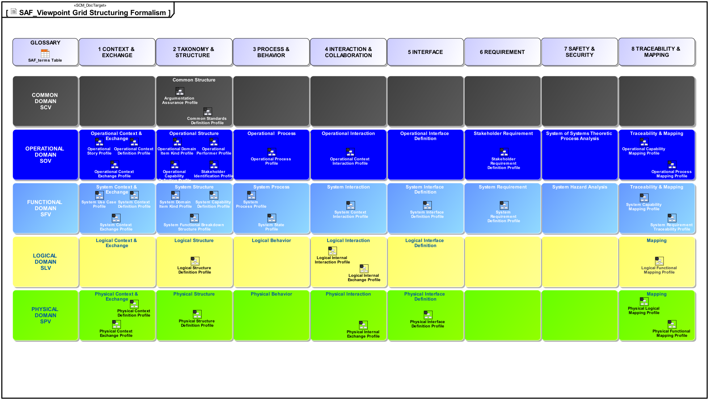

# User Documentation
System Architecture Framework Specification  **is work in progress**

This repository contains both documentation for users of SAF and developers of SAF. To understand how we develop SAF, see **[how SAF is developed](developing-saf/development.md). We always welcome contributions from our MBSE community to improve SAF, see [how to contribute to SAF](contributing.md).**

The System Architecture Framework Specification application is demonstrated using the **Fire Forest Detection System (FFDS)** example, courtesy of Tim Weilkiens. The Fire Forest Detection System example is based on the publication **SYSMOD - The Systems Modeling Toolbox, 3rd edition Pragmatic MBSE with SysML, Tim Weilkiens**

## SAF Releases
This is the main branch that reflects the current state of development and it is updated as required. See the [change report](CHANGES.md) for an information about major changes.

The following SAF releases are available, each of which is managed in a separate branch:
* [Initial Release](https://github.com/GfSE/SAF-Specification/tree/Initial-Release/README.md)
* [TdSE2022](https://github.com/GfSE/SAF-Specification/tree/TdSE2022/README.md)
* [TdSE2023](https://github.com/GfSE/SAF-Specification/tree/TdSE2023/README.md)

## SAF Tool Implementations
The SAF specification is implemented by 3 tool specific profiles which are available in separate github repositories:

* [Cameo Systems Modeler (by Dassault Systèmes)](https://github.com/GfSE/SAF-Cameo-Profile)
* [Engineering Systems Design Rhapsody (by IBM)](https://github.com/GfSE/SAF-Rhapsody-Profile)
* [Enterprise Architect (by Sparx Systems)](https://github.com/GfSE/SAF-EA-Profile)

# SAF Viewpoint Grid

The SAF Viewpoints are organized as a Grid featuring [Domains](userdoc/domains.md) as rows and [Aspects](userdoc/aspects.md) as columns.

