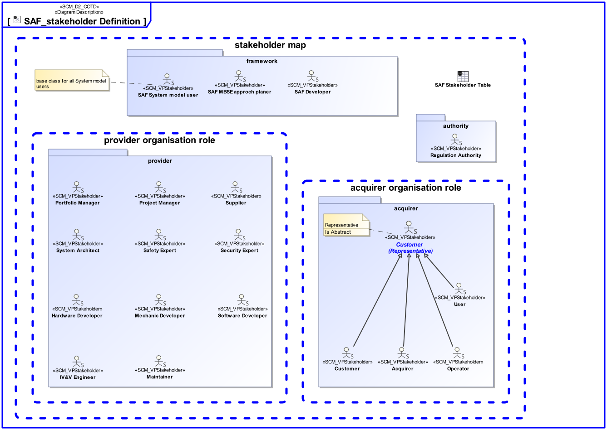

# SAF User Documentation : Stakeholders

This section provides a list of the Stakeholder roles considered for the elicitation of concerns for SAF viewpoints. For each, the section lists the concerns that the Stakeholder has that can be addressed by the information in this SAF framework.

Each Stakeholder of a system - customer, user, project manager, coder, analyst, tester, and so on - is concerned with different characteristics of the system that are affected by its architecture.

For example, the user has specific concerns which interactions he or she has with the system.; the customer is has a concern if and how the operational capabilities are supported by the system.

The stakeholders concerns vary with project phases, e.g. the system architect needs to make sure before a PDR, that the systems function are delegated to subsystems completely, and to communicate this to subsystem responsibles.

The following subchapters describe the stakeholders and their concerns:



# {{ element.Name }} 

{{ element.Documentation }}
## Concern

* {{ rationale.Concern }}
      *{{ rationale.Rationale  }}* 


